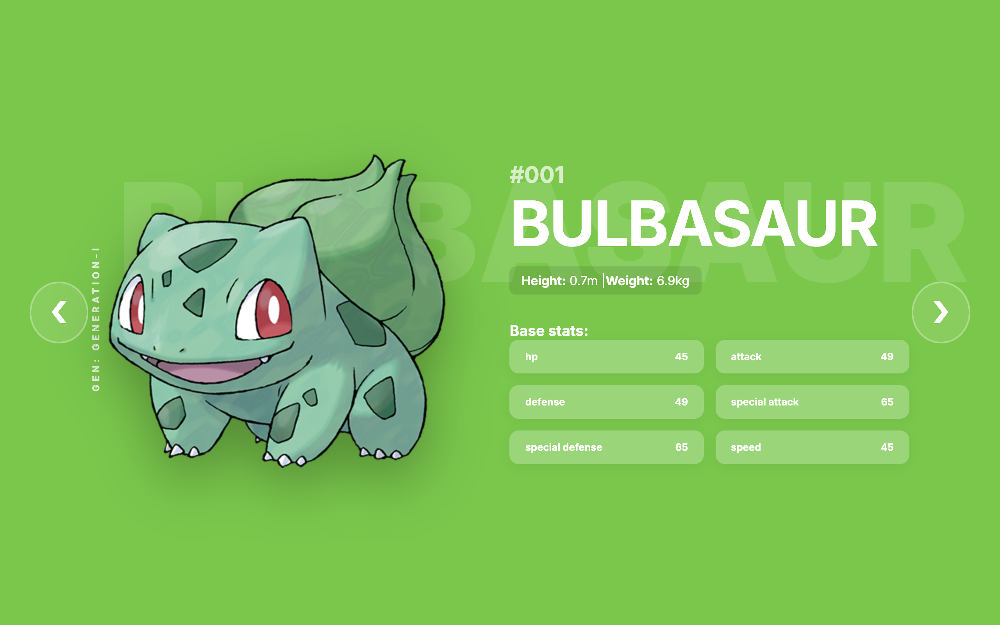
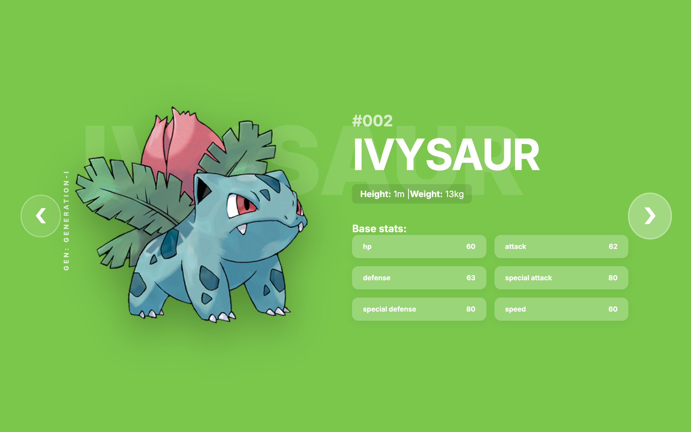
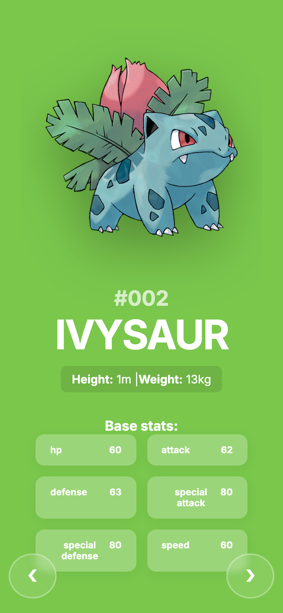

# Pokédex

> Porque todo dev precisa de _mais uma_ Pokédex no portfólio. 😏

Uma Pokédex digital que permite visualizar informações sobre diferentes Pokémon. Navegue sequencialmente entre os Pokémon usando botões ou as teclas de seta do teclado. Os dados são carregados dinamicamente da [PokeAPI](https://pokeapi.co/) e a estilização muda conforme o tipo do Pokémon exibido.

## Screenshots





## Como executar

```bash
npm install
npm run dev
```

Acesse [http://localhost:5173](http://localhost:5173)

## Funcionalidades

- **Visualização de Pokémon**: cartão estilo Pokédex com imagem, nome, estatísticas e descrição da espécie
- **Navegação**: botões ou teclas ← → para próximo/anterior
- **Cores dinâmicas**: fundo muda conforme o tipo do Pokémon
- **Carregamento dinâmico**: dados buscados de forma assíncrona
- **Pré-carregamento**: imagens do Pokémon seguinte e anterior são pré-carregadas para navegação fluida
- **Responsivo**: layout adaptável para mobile

## Tecnologias

| Categoria    | Stack                              |
| ------------ | ---------------------------------- |
| Frontend     | React 19, TypeScript, Vite         |
| Dados/Estado | TanStack Query, React Context API  |
| Requisições  | Axios                              |
| Estilização  | Tailwind CSS, Framer Motion        |
| Testes       | Vitest, React Testing Library, MSW |
| API          | [PokeAPI](https://pokeapi.co/)     |

## Estrutura do projeto

```
src/
├── components/       # Componentes React
│   └── PokedexCard/  # VisualSide, DataSide, Image, BackgroundText, GenerationTag
├── entities/        # Tipos e interfaces (Pokemon, PokemonSpecies)
├── hooks/           # usePokemon, usePokemonSpecies, usePreloadImages, usePokedexCard
├── mocks/           # Handlers e server MSW para testes
├── services/        # pokemonService (Axios → PokeAPI)
├── stores/          # SearchStore (Context API)
├── test/            # Setup, MSW mocks e testes
├── utils/           # colors, formatters, pokemonTypePalette, sprites
├── App.tsx
├── main.tsx
└── index.css
```

## Scripts disponíveis

| Comando         | Descrição                                          |
| --------------- | -------------------------------------------------- |
| `npm run dev`   | Inicia o servidor de desenvolvimento com HMR       |
| `npm run build` | Compila a aplicação para produção na pasta `dist/` |
| `npm run test`  | Executa os testes com Vitest                       |

## Documentação

A documentação detalhada está em `docs/`:

- [00 - Visão Geral](docs/00_project_overview.md)
- [01 - Stack de Tecnologia](docs/01_tech_stack.md)
- [02 - Estrutura do Projeto](docs/02_project_structure.md)
- [03 - Fluxo de Dados](docs/03_data_flow.md)
- [04 - Biblioteca de Componentes](docs/04_component_library.md)
- [05 - Ferramentas e Scripts](docs/05_tooling_and_scripts.md)
